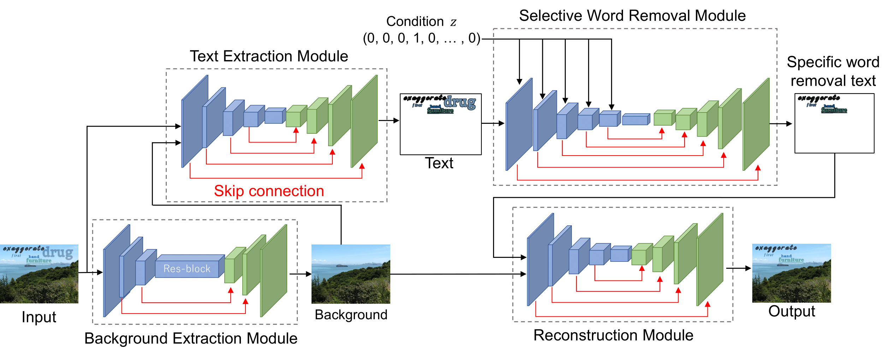
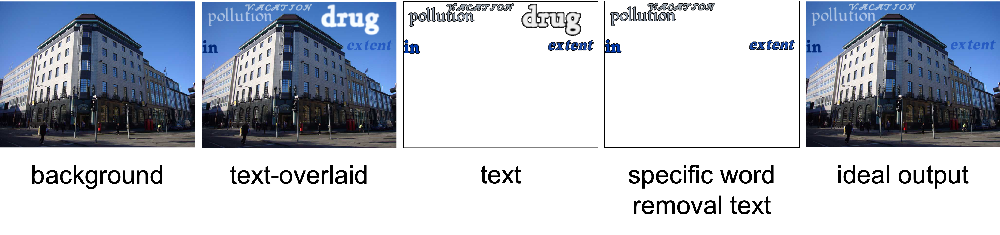

# Selective Scene Text Removal (SSTR)

This is the pytorch implementation of Paper: Selective Scene Text Removal (BMVC2023).
The paper is available at [this link](https://arxiv.org/abs/2309.00410).

## Setup
To set up their environment, please run:  
(we recommend to use [Anaconda](https://www.anaconda.com/) for installation.)
```
conda env create -n SSTR -f SSTR.yml
conda activate SSTR
```

## Dataset

We used a dataset created by [SynthText](https://github.com/ankush-me/SynthText).
Five types of images were used: a background image, a composite image created by SynthText, a text-only image, a text image with a specific word removed, and an ideal output image.
The image above shows an example of the specific word "drug" .  
In addition, a csv file containing the conditions used by the Selective Word Removal Module is required.
For example, if the target words are {dog, cat, car, book}, the condition is 2 if cat is to be removed.
The one-hot vector in this case is (0, 1, 0, 0).  
For details, check the data structure in the `sample_data` folder.

## Execution scripts
### train
`(module name)_train.py`: Training codes for each module.  
`selective_scene_text_removal_fine-tuning_train.py`: end-to-end fine-tuning code.

### test
`(Module name)_test.py`: Test codes for each module.  
`selective_scene_text_removal_fine-tuning_test.py`: SSTR test code.

## Annotation
We refer to SRNet to develop Background Extraction Module. Also, we refer to Conditioned U-Net to develop Selective Word Removal Module. The links for each implementation are as follows.  
SRNet : https://github.com/Niwhskal/SRNet  
Conditioned U-Net : https://github.com/ws-choi/Conditioned-U-Net-pytorch  
**Each of these modules may be used under a separate license.**

## Citation
If you make use of our work, please cite our paper:
```
@article{mitani2023selective,
  title={Selective Scene Text Removal},
  author={Mitani, Hayato and Kimura, Akisato and Uchida, Seiichi},
  journal={arXiv preprint arXiv:2309.00410},
  year={2023}
}
```
